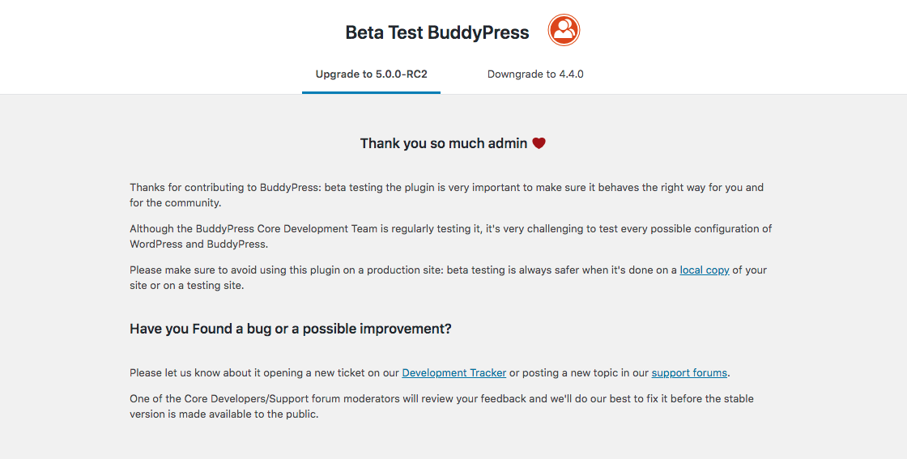

# BuddyPress Beta Tester

A plugin to switch between stable, beta or RC versions of BuddyPress.

## Description

BP Beta Tester provides an easy way to get involved with Beta testing BuddyPress.

Once installed it will help you to upgrade your website to the latest Beta or Release candidate. You will also be able to downgrade to the latest stable release once you finished your Beta tests.

Thanks in advance for contributing to BuddyPress: beta testing the plugin is very important to make sure it behaves the right way for you and for the community. Although the BuddyPress Core Development Team is regularly testing it, it's very challenging to test every possible configuration of WordPress and BuddyPress.

### !important

Please make sure to avoid using this plugin on a production site: beta testing is always safer when it's done on a local copy of your site or on a testing site. And of course: **don’t forget to backup before you start**!

## Join our community

If you're interested in contributing to BuddyPress, we'd love to have you. Head over to the [BuddyPress Documentation](https://codex.buddypress.org/participate-and-contribute/) site to find out how you can pitch in.

BuddyPress is available in many languages thanks to the volunteer efforts of individuals all around the world. Check out our [translations page](https://codex.buddypress.org/translations/) on the BuddyPress Documentation site for more details. If you are a polyglot, please [consider helping translate BuddyPress](https://translate.wordpress.org/projects/wp-plugins/buddypress) into your language.

Growing the BuddyPress community means better software for everyone!

## Installation

### Requirements

To run BP Beta Tester, we recommend your host/local setup supports:

* PHP version 7.2 or greater.
* MySQL version 5.6 or greater, or, MariaDB version 10.0 or greater.

### Manual installation

1. If you want to contribute, clone the plugin into the `/wp-content/plugins` directory of your testing site using the command line `git clone https://github.com/buddypress/bp-beta-tester.git`
2. If you want to simply use, go to the release page of this repository to download the `bp-beta-tester.zip` archive of the plugin. Use the "Add New" link of your WordPress Plugins Administration to upload this file.

### Activation

1. If you are using a Multisite configuration of WordPress: head over to the Plugins Network Administration to activate BP Beta Tester.
2. Otherwise, go to the Plugins Administration to activate it.

Once activated, go to the home page of your Dashboard (Network Dashboard if your are using WordPress Multisite) to find the BP Beta Tester sub menu of the Dashboard menu. From this page and the main tabs you'll be able to install Beta or Release Candidates as well as downgrade to the latest stable release.

Happy Testing 😍
